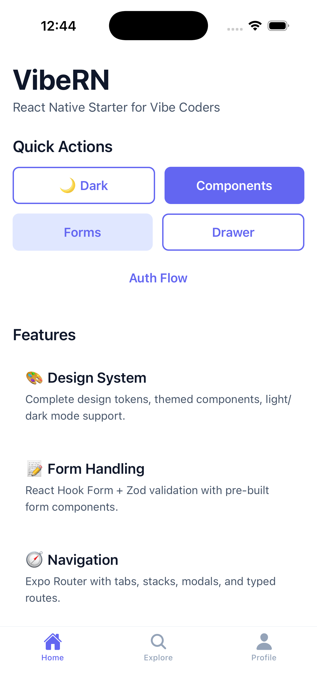
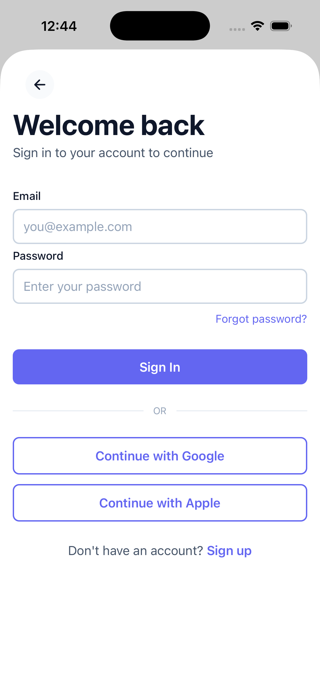
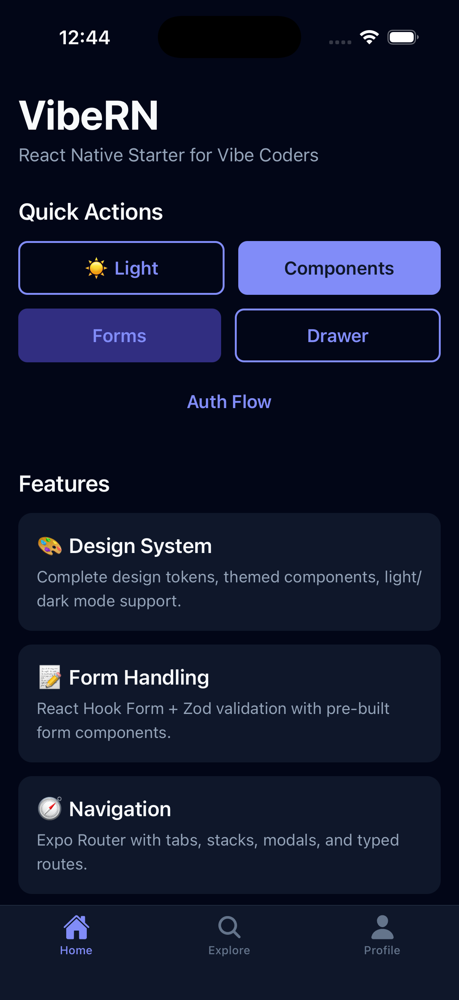
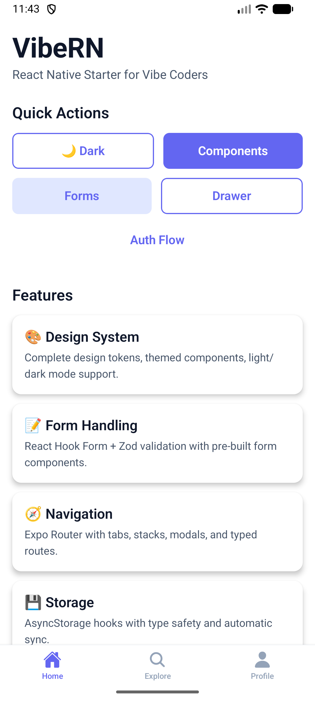
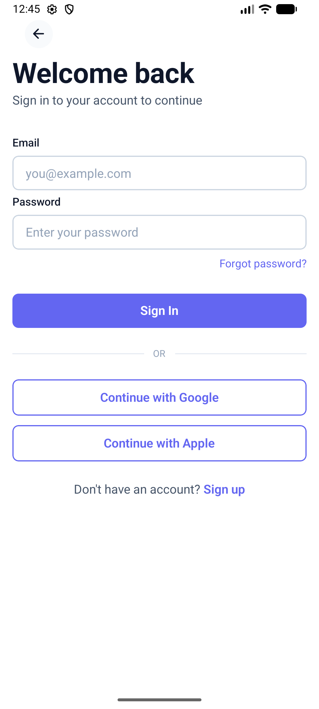
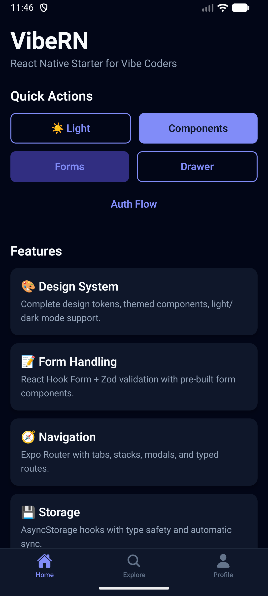

# VibeRN

A production-ready React Native (Expo) starter kit for vibe coders. Features a complete design system, form handling, navigation patterns, and excellent developer experience.

## Quick Start

```bash
# Create a new project from this template
npx degit markshenouda/VibeRN my-app
cd my-app

# Install dependencies
npm install

# Start development server
npm run dev

# Run on iOS
npm run ios

# Run on Android
npm run android
```

## Features

- **Design System**: Complete token-based design system with light/dark mode
- **Form Handling**: react-hook-form + zod with pre-built form components
- **Navigation**: Expo Router with tabs, stacks, drawers, modals, and typed routes
- **Storage**: AsyncStorage hooks with TypeScript support
- **Static Testing**: ESLint 9, Prettier, TypeScript strict mode, lefthook
- **Developer Experience**: Path aliases, VSCode settings, AI agent rules
- **Scripts**: Project cleaning, icon generation, screen scaffolding

## Screenshots

### iOS

<p align="center">
  
  
  
</p>

### Android

<p align="center">
  
  
  
</p>

## Project Structure

```
src/
├── app/                    # Expo Router screens
│   ├── (tabs)/            # Tab navigation (home, explore, profile)
│   ├── (auth)/            # Auth screens (login, register) (removable)
│   ├── (examples)/        # Example screens including drawer (removable)
│   │   └── drawer/        # Drawer navigation example
│   └── _layout.tsx        # Root layout with providers
├── components/
│   ├── ui/                # Design system primitives
│   ├── forms/             # Form components
│   └── patterns/          # Common UI patterns
├── design-system/
│   ├── tokens/            # Colors, typography, spacing
│   └── ThemeProvider.tsx  # Theme context
├── hooks/                 # Custom React hooks
├── lib/                   # Utilities and validation
└── constants/             # App configuration
```

## Documentation

- [Design System Guide](docs/DESIGN_SYSTEM.md) - Colors, typography, components
- [Components Reference](docs/COMPONENTS.md) - All UI components
- [Form Handling](docs/FORMS.md) - Form validation patterns
- [Navigation](docs/NAVIGATION.md) - Routing and navigation
- [Scripts](docs/SCRIPTS.md) - Available npm scripts

## Usage Examples

### Using the Design System

```tsx
import { useTheme } from '@/design-system';
import { Text, Button, Card } from '@/components/ui';

function MyComponent() {
  const { theme, isDark, toggleTheme } = useTheme();

  return (
    <Card>
      <Text variant="h2">Hello World</Text>
      <Button onPress={toggleTheme}>{isDark ? 'Light Mode' : 'Dark Mode'}</Button>
    </Card>
  );
}
```

### Form with Validation

```tsx
import { useForm } from 'react-hook-form';
import { zodResolver } from '@hookform/resolvers/zod';
import { FormInput, loginFormSchema } from '@/components/forms';
import { Button } from '@/components/ui';

function LoginForm() {
  const { control, handleSubmit } = useForm({
    resolver: zodResolver(loginFormSchema),
  });

  return (
    <>
      <FormInput name="email" control={control} label="Email" />
      <FormInput name="password" control={control} label="Password" secureTextEntry />
      <Button onPress={handleSubmit(onSubmit)}>Login</Button>
    </>
  );
}
```

### AsyncStorage Hook

```tsx
import { useAsyncStorage } from '@/hooks';

function Settings() {
  const [settings, setSettings] = useAsyncStorage('settings', defaultSettings);

  return (
    <Switch
      value={settings.notifications}
      onValueChange={(value) => setSettings({ ...settings, notifications: value })}
    />
  );
}
```

## Scripts

```bash
# Development
npm run dev              # Start Expo dev server
npm run ios              # Run on iOS
npm run android          # Run on Android

# Code Quality
npm run lint             # Run ESLint
npm run typecheck        # TypeScript check
npm run format           # Format with Prettier
npm run check            # Run all checks

# Project Management
npm run clean            # Remove example screens
npm run new:screen       # Scaffold new screen
npm run generate:icons   # Generate app icons
npm run generate:splash  # Generate splash screen
```

## Customization

### 1. Update App Info

Edit `app.json`:

```json
{
  "expo": {
    "name": "Your App Name",
    "slug": "your-app",
    "scheme": "yourapp"
  }
}
```

### 2. Change Brand Colors

Edit `src/design-system/tokens/colors.ts`:

```typescript
export const palette = {
  primary: {
    500: '#your-color',
    // ... other shades
  },
};
```

### 3. Clean Example Screens

```bash
npm run clean
```

This removes example screens and resets tabs to minimal templates.

## Tech Stack

- **Framework**: React Native with Expo SDK 54
- **Navigation**: Expo Router 6
- **Forms**: react-hook-form + zod
- **Storage**: @react-native-async-storage/async-storage
- **Animations**: react-native-reanimated
- **Gestures**: react-native-gesture-handler
- **TypeScript**: Strict mode with path aliases

## AI Agent Support

This project includes configuration files for AI assistants:

- `.cursor/rules` - Cursor AI rules
- `.github/copilot-instructions.md` - GitHub Copilot instructions

These files help AI understand the project structure and coding conventions.

## License

MIT
